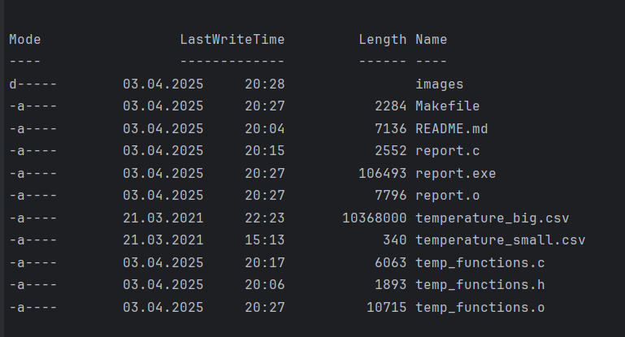
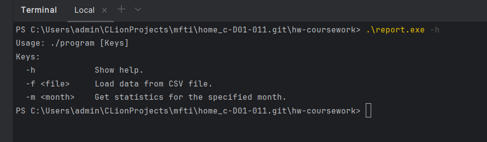
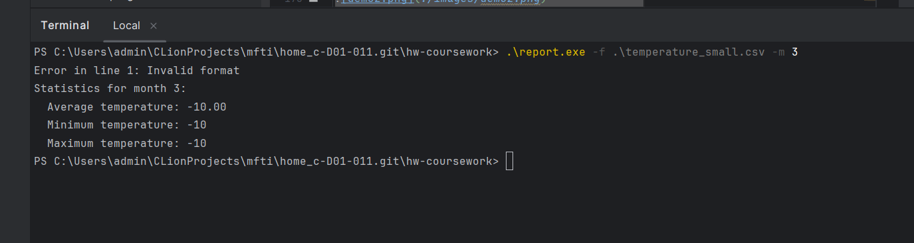
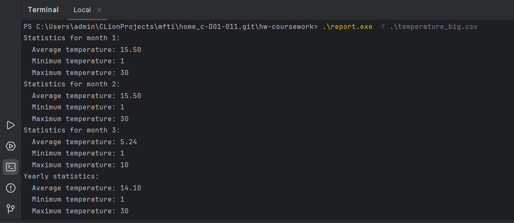
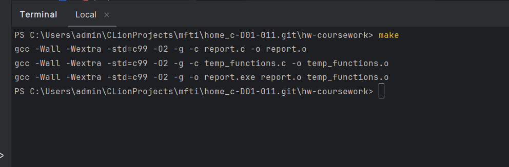

# Итоговая работа по курсу   "Программирование на языке С   (базовый уровень)"
_________

## Создание консольного приложения - Статистика температуры.     

> Необходимо реализовать консольное приложение, 
которое осуществляет считывание текстового файла csv, состоящего из строк следующего формата:

- YEAR;
- MONTH;
- DAY;
- HOUR;
- MINUTE;
- TEMPERATURE
___

- dddd;
- mm;
- dd;
- hh;
- mm;
- temperature
______________

- dddd - год 4 цифры

- mm - месяц 2 цифры

- dd - день 2 цифры

- hh - часы 2 цифры

- mm - минуты 2 цифры

- temperature - целое число от -99 до 99

> В файле хранится статистика собранная датчиком температуры за
1 календарный год. Предполагается, что датчик собирал
информацию не чаще чем 1 раз в минуту и сохранял в заданном
формате каждое значение в текстовый файл с новой строки. В
какой-то момент времени датчик мог не работать, тогда данные по
этому периоду могут отсутствовать. Пример входного файла:

----------------------------------
| YEAR |  MONTH  |  DAY  |  HOUR  |  MINUTE  |  TEMPERATURE  |
|:----:|:-------:|:-----:|:------:|:--------:|:-------------:|
| 2021 |    1    |   1   |   23   |    1     |      -5       |
| 2021 |    1    |   1   |   23   |    3     |      -6       | 
| 2021 |    1    |   1   |   23   |    1     |      -7       |
| 2021 |    1    |   2   |   7    |    5     |      -10      |

--------
## __Необходимо вывести статистику по каждому месяцу, с учетом исходных данных:__

* среднемесячная температура
* минимальная температура в текущем месяце
* максимальная температура в текущем месяце

## Также необходимо вывести статистику за год:

* среднегодовая температура
* минимальная температура
* максимальная температура

> Приложение должно обрабатывать аргументы командной строки:
минимальный набор поддерживаемых ключей:
> 
 

• -h Описание функционала приложения. Список ключей, которые
обрабатывает данное приложение и их назначение.\
 
• -f <filename.csv> входной файл csv для обработки.\
 
• -m <номер месяца> если задан данный ключ, то выводится\
только статистика за указанный месяц.
- если нет параметров, то выдается help

## Требования к ошибкам в входных данных
> Приложение должно корректно работать на любых входных
данных, если формат csv файла не соответствует заданному, то
необходимо указать номер строки файла csv, в которой
обнаружена ошибка и не учитывать данную строку
>

## Требования к сборке приложения

______________

> Приложение должно собираться при помощи утилиты **make**.
> 
___________

> Все прототипы функций используемые в приложении должны быть
вынесены в отдельный файл **temp_functions.h**
> 
______________
> Тексты функций - в файл **temp_functions.c**

####  __**Для реализации приложения рекомендуется использовать массив из структурного типа данных для хранения показаний датчика.**__

______________________________________
_____________________________________

# Описание программы

## Исходный код программы

<https://github.com/DarkWolf1990/home_c/tree/master/hw-coursework>

--------
## Описание файлов программы
    images - директория с изображениями для описания проекта
    Makefile - файл для сборки
    README.md - описание проекта
    report.c - основной файл программы (содержит основную логику)
    report.exe - исполняемый файл программы
    report.o - объектный файл программы
    temp_functions.c - файл с реализацией функций
    temp_functions.h - файл с прототипами функций
    temp_functions.o - объектный файл с реализацией функций
    temperature_big.csv - пример csv-файла с большим количеством записей
    temperature_small.csv - пример csv-файла с малым количеством записей

    

## Команды для сборки

    make clean
    make
    make run

## Использование программы

    report.exe -h
    report.exe -f <filename.csv> -m <номер месяца>      

## Вывод программы

    Статистика по месяцам:
    Статистика за год:

## Описание работы программы

    Программа является консольным приложением и рекомендуется запускать её из коммандной строки.
    Также программа считывает данные из csv-файла и выводит статистику по месяцам и за год.
    При запуске программы без ключей, программа выведит информацию о своём назначении и предложит ввести ключ "-h",
    для получения инструкций.

*Программа допускает применение следующих ключей:* 

    -h Описание функционала приложения. Список ключей, которые
    обрабатывает данное приложение и их назначение.
    -f <filename.csv> входной файл csv для обработки.
    -m <номер месяца> если задан данный ключ, то выводится
    только статистика за указанный месяц.
    - если нет параметров, то выдается статистика по всем месяцам.

## Примеры написаний командной строки для запуска:

    .\report.exe 
    .\report.exe  -h
    .\report.exe  -f small_file.csv
    .\report.exe  -f big_file.csv -m 3

## Демонстрация работы программы

- *__Рисунок 1. Запуск программы с опцией "-h"__*

- *__Рисунок 2. Запуск программы с опцией "-f small_file.csv"__*

- *__Рисунок 3. Запуск программы с опцией "-f big_file.csv"__*

## Сборка программы утилитой make

