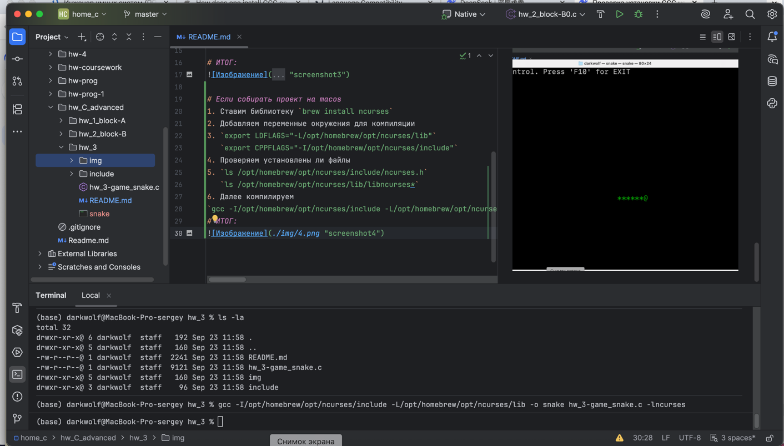
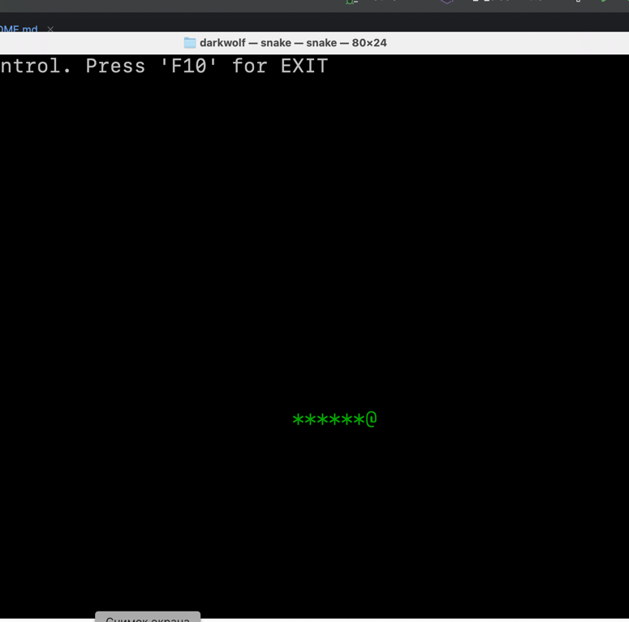

# Подготовка и подключение библиотеки #
* Сначала скачиваем библиотеку с git репозитория <https://github.com/wmcbrine/PDCurses.git> 
* далее разархивируем и переходим в директорию PDCurses-master 
* из директории PDCurses-master копируем в свой проект файл `curses.h` предварительно создав в проекте подкаталог `include`
* и можно сразу же в корне проекта создать подкатолог `lib` позже мы в него добавим скомпилированный файл библиотеки `pdcurses.a`
* возвращаемся в папку со скаченной библиотекой  `PDCurses-master` и переходим в директорию `wincon`, и выполняем следующую команду `mingw64-make -f Makefile` - при условии, что в системе установлена именно 64 версия, если так же как и у меня, то команда будет такой `mingw32-make -f Makefile INFOEX=N` за счет параметра `INFOEX=N` библиотека не будет собираться полностью, так как в 32 битной версии нет поддержки всех функций библиотеки, но для текущего проекта это не важно.
* После выполнения команды `mingw32-make -f Makefile INFOEX=N` мы получим файл `pdcurses.a`, который надо скопировать в директорию `lib`
* Далее не забываем подключить в рабочем файле библиотеку `#include <curses.h>`
*
* После выполняем сборку проекта выполнив следующие команды в консоли gcc hw_3-game_snake.```c -o hw_3-game_snake 
  -I"$PWD/include" 
  "$PWD/lib/pdcurses.a"```
____
  
  
# ИТОГ:


# Если собирать проект на macos 
1. Ставим библиотеку `brew install ncurses`
2. Добавляем переменные окружения для компиляции 
3. `export LDFLAGS="-L/opt/homebrew/opt/ncurses/lib"`
   `export CPPFLAGS="-I/opt/homebrew/opt/ncurses/include"`
4. Проверяем установлены ли файлы 
5. `ls /opt/homebrew/opt/ncurses/include/ncurses.h`
   `ls /opt/homebrew/opt/ncurses/lib/libncurses*`
6. Далее компилируем 
`gcc -I/opt/homebrew/opt/ncurses/include -L/opt/homebrew/opt/ncurses/lib -o snake hw_3-game_snake.c -lncurses`
# ИТОГ:

